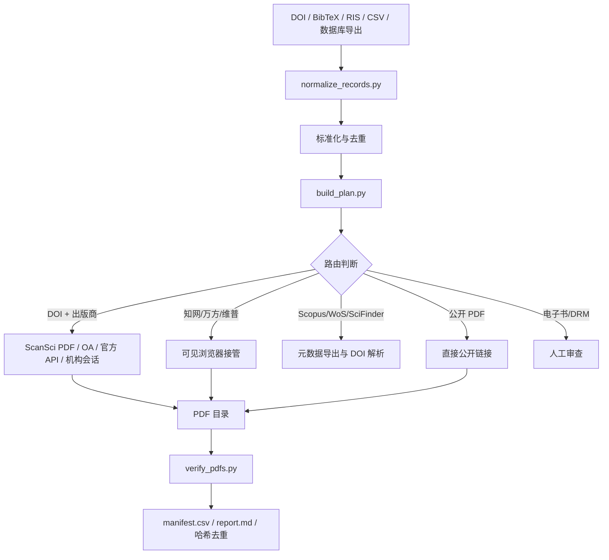

# ScholarBridge｜文献桥

> 面向科研人员与 AI Agent 的机构授权文献获取中枢：统一处理 DOI、BibTeX、RIS、CSV 和数据库导出，自动完成标准化、去重、平台识别、获取路径规划、浏览器接管、PDF 核验与失败清单生成。

ScholarBridge 不是一个“绕过付费墙”的下载器，也不是一个对所有网站强行爬取的万能脚本。它解决的是更实际的问题：**当用户已经拥有学校图书馆、WebVPN、CARSI、EZproxy 或出版社机构订阅权限时，如何把分散的检索、登录、下载、核验与归档步骤组织成一个统一、可审计、可复用的工作流。**

## 为什么需要 ScholarBridge

现实中的学术资源平台角色不同：

- Scopus、Web of Science、SciFinder 主要用于检索、引文追踪和导出题录；
- ScienceDirect、Springer Nature、Wiley、IEEE、ACS、RSC 等平台承载出版商全文；
- 知网、万方、维普既承担中文文献检索，也提供机构授权全文；
- CARSI、WebVPN、EZproxy、OpenAthens、Shibboleth 是访问入口，而不是文献数据库；
- 电子书平台还可能涉及借阅、在线阅读器与 DRM，不能套用期刊 PDF 的下载逻辑。

传统脚本通常只支持一个网站、一种格式或一种登录方式，而且页面一改就失效。ScholarBridge 将这些环节拆成标准流程：

```text
文献清单/数据库导出
        ↓
标准化、DOI 提取、去重
        ↓
平台角色识别与路径规划
        ↓
开放获取 / 官方 API / 机构浏览器 / 人工接管
        ↓
PDF 核验、哈希去重、失败分类
        ↓
manifest.csv + report.md + 待处理队列
```

## 核心能力

### 1. 多格式文献清单标准化

支持以下输入：

- DOI 或 DOI URL 文本列表；
- 论文标题、引文和网页链接；
- CSV、TSV、JSON、JSONL；
- BibTeX；
- RIS、EndNote 导出；
- Scopus、Web of Science、SciFinder 等数据库导出的题录文件；
- 已下载的 PDF 文件夹。

系统会统一字段、规范 DOI、识别重复记录，并分别输出可用记录、重复记录和被拒绝记录。

### 2. 平台角色识别与智能路由

ScholarBridge 不会把所有数据库都误认为 PDF 仓库，而是根据平台角色选择路径：

| 平台类型 | 代表平台 | 默认处理方式 |
|---|---|---|
| 出版商全文平台 | ScienceDirect、Springer Nature、Wiley、IEEE/IET、ACS、RSC、Taylor & Francis、Oxford、IOP | DOI 路由到开放获取、官方 API 或本地机构会话 |
| 中文全文数据库 | 中国知网、万方、维普 | 生成可见浏览器接管队列，用户完成登录、验证码与原生下载 |
| 引文数据库 | Scopus、Web of Science | 导出 DOI/标题，再转交全文获取层 |
| 专业索引 | SciFinder | 导出文献标识符，不假设其直接承载 PDF |
| 聚合检索平台 | 图书馆发现系统、寻知 | 解析 DOI 或真实提供商地址 |
| 机构认证入口 | WebVPN、CARSI、EZproxy、OpenAthens、Shibboleth | 用户在可见浏览器中完成认证 |
| 电子书平台 | 畅想之星、可知、爱学术、百图 | 独立人工审查，不绕过 DRM 或借阅限制 |

### 3. ScanSci PDF 集成

当本地安装 `scansci-pdf` 时，ScholarBridge 可以把 DOI 队列交给它执行，并在调用前自动采用保守配置：

- 关闭非授权来源；
- 单线程或低并发；
- 设置请求间隔；
- 保存命令、日志和返回状态；
- 遇到访问错误时停止并报告。

ScholarBridge 本身不捆绑第三方下载器，也不会在用户不知情的情况下自动安装外部工具。

### 4. 中文数据库浏览器接管

针对知网、万方和维普，默认生成：

- `browser_queue.csv`：待处理文献队列；
- `browser_handoff.md`：逐条浏览器操作说明；
- 平台、标题、DOI、URL 和处理状态；
- 登录、验证码、无权限、CAJ-only 等待处理状态。

用户在学校图书馆入口或授权 VPN 中完成登录，使用平台原生下载按钮。Skill 不提取账号密码、不破解验证码、不寻找隐藏下载接口，也不规避平台配额。

### 5. PDF 真实性核验与重复检测

下载完成后可自动检查：

- 文件是否具有有效 `%PDF-` 头；
- 文件体积是否合理；
- 文件尾是否包含 EOF 标识；
- SHA-256 哈希；
- 是否存在内容完全相同的重复文件；
- 是否需要将无效文件移入隔离目录。

### 6. 可审计的任务报告

每次运行都会保留完整目录和结构化结果，包括：

- 输入记录数、去重数与拒绝数；
- 各平台与各路由任务数量；
- 已下载、已核验和重复 PDF 数量；
- 需要浏览器操作的任务；
- 需要 DOI/题名解析的任务；
- `not_entitled`、`captcha_required`、`rate_limited`、`ip_blocked` 等明确状态；
- `manifest.csv`、`report.md`、日志和 PDF 核验清单。

## 工作流架构



## 快速开始

### 方式一：作为 ChatGPT Skill 使用

1. 下载仓库中的 `dist/skill.zip`；
2. 在支持 Skills 的 ChatGPT 环境中上传并安装；
3. 在对话中上传 DOI、RIS、BibTeX、CSV 或数据库导出文件；
4. 直接描述任务，例如：

```text
把这个 Web of Science 导出的 RIS 规范化，去重后下载所有在我校授权范围内可以获取的论文，并生成失败清单。
```

```text
我已经进入学校 WebVPN。请把这批知网、万方和维普文献分平台生成浏览器下载队列。
```

```text
检查这个 PDF 文件夹中有没有网页伪装成的假 PDF、损坏文件和重复文献。
```

### 方式二：本地运行脚本

要求 Python 3.10 或更高版本。

```bash
git clone https://github.com/LHT666-hub/ScholarBridge.git
cd ScholarBridge
python scripts/doctor.py --output literature_run/doctor.json
python scripts/normalize_records.py assets/input.example.csv --output-dir literature_run/normalized
python scripts/build_plan.py literature_run/normalized/records.jsonl --output-dir literature_run/plan
python scripts/authorized_fetch.py literature_run/plan/plan.jsonl --run-dir literature_run/execution --output-dir literature_run/papers
```

最后一条命令默认只生成 dry run 计划，不会直接下载。

确认计划并具备合法机构访问权限后：

```bash
python scripts/authorized_fetch.py literature_run/plan/plan.jsonl \
  --run-dir literature_run/execution \
  --output-dir literature_run/papers \
  --execute
```

核验下载结果：

```bash
python scripts/verify_pdfs.py literature_run/papers --output-dir literature_run/verification
python scripts/summarize_run.py --output literature_run/report.md
```

## 可选：安装 ScanSci PDF

```bash
pip install "scansci-pdf[cloakbrowser,instsci]"
scansci-pdf check
```

然后使用 ScholarBridge 的执行脚本调度 DOI 队列。机构认证始终应由用户在本地可见浏览器中完成。

## 默认安全策略

ScholarBridge 默认采用保守模式：

- 优先开放获取和官方接口；
- 不保存或上传学校账号密码；
- 不自动破解验证码或二次认证；
- 不绕过付费墙、DRM、下载配额和机构授权；
- 不使用代理池轮换来规避限制；
- 单线程、低频请求；
- 遇到 403、429、访问警告、账号/IP 封禁或连续验证码立即停止；
- 未经核验不宣称 PDF 下载成功；
- 大规模文本与数据挖掘应优先申请出版商 TDM/API 权限。

**拥有机构订阅不等于获得无限自动化下载许可。使用者仍需遵守所在学校、图书馆、数据库和出版商的许可协议。**

## 项目结构

```text
ScholarBridge/
├── SKILL.md
├── README.md
├── agents/
│   └── openai.yaml
├── scripts/
│   ├── authorized_fetch.py
│   ├── build_plan.py
│   ├── common.py
│   ├── doctor.py
│   ├── normalize_records.py
│   ├── summarize_run.py
│   └── verify_pdfs.py
├── references/
│   ├── api_reference.md
│   ├── compliance.md
│   ├── platform-matrix.md
│   ├── schema.md
│   └── setup.md
├── assets/
│   ├── config.example.json
│   └── input.example.csv
└── dist/
    └── skill.zip
```

## 当前边界

当前版本重点提供**统一编排、规范化、路由、浏览器接管和核验能力**，并不承诺所有平台都能无人值守下载。以下情况通常需要用户参与：

- 学校 WebVPN、CARSI、Shibboleth 或 OpenAthens 登录；
- 验证码、短信、二次认证；
- 知网、万方、维普页面下载；
- 只有 CAJ 或在线阅读权限的记录；
- 没有 DOI、题名不完整或元数据冲突；
- 数据库明确禁止自动化操作；
- 电子书借阅、在线阅读器和 DRM 内容。

## Roadmap

- [ ] 增加更完整的 Scopus、WoS、SciFinder 字段映射模板；
- [ ] 建立可插拔的 Publisher Adapter 协议；
- [ ] 增加知网、万方、维普队列状态回填工具；
- [ ] 与 Zotero 本地库联动并自动归档附件；
- [ ] 提供可视化任务面板；
- [ ] 增加 MCP Server，把文献获取流程暴露给 Claude Code、Codex 等 Agent；
- [ ] 增加单元测试和真实数据库的兼容性回归测试；
- [ ] 建立平台页面变化的适配器维护机制。

## 贡献

欢迎提交 Issue 或 Pull Request，尤其欢迎贡献：

- 新的数据库导出字段映射；
- 合法、稳定、可维护的平台适配方案；
- 失败状态识别；
- PDF 校验与元数据匹配；
- 文档、测试用例和不同学校认证环境的兼容性报告。

贡献代码不得包含账号凭据、Cookie、付费全文、验证码绕过逻辑、隐藏下载接口或规避平台限制的功能。

## 免责声明

本项目用于组织用户已经合法拥有访问权限的学术资源获取流程。项目作者和贡献者不提供数据库账号、不分发受版权保护的全文，也不鼓励违反机构许可、出版商条款或当地法律的自动化下载行为。使用者须自行确认其访问权限、自动化范围和数据使用目的是否合法合规。
