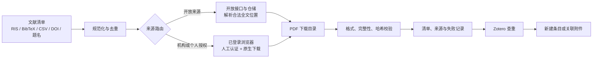

# ScholarBridge｜从文献清单到 PDF 与 Zotero

ScholarBridge 是一个面向真实科研资料环境的文献获取 Skill。它把 DOI、题名、
PMCID、arXiv ID、RIS、BibTeX、CSV 和数据库导出，转化为经过校验、可追踪、
可去重的本地 PDF，并继续交接到 Zotero。

它的目标不是再做一个“文献搜索器”，而是补上科研工作流中经常断开的这一段：

> **发现文献之后，怎样在合法访问范围内真正获得 PDF，验证文件，整理记录，
> 并进入个人文献库。**

## 为什么要做 ScholarBridge

现有文献工具往往只解决一个局部问题：

- 学术搜索工具能发现文献，但不保证获得全文；
- 开放获取工具能解析部分 DOI，但无法处理机构订阅数据库；
- 浏览器自动化能够点击下载，却不负责文件校验、去重和审计；
- Zotero 能管理论文，但从检索结果到题录、PDF 和附件之间仍有大量手工操作；
- 单个平台脚本通常依赖固定页面结构，换一个数据库就难以复用。

真实科研环境还同时包含两类来源：

1. **开放来源**：arXiv、PMC、开放期刊、机构知识库和作者公开版本；
2. **授权来源**：知网、万方、维普、Web of Science、Scopus 和出版社平台。

因此，ScholarBridge 不把某个数据库脚本包装成万能下载器，而是建立一条统一、
可分阶段执行的文献获取流水线，同时为开放来源和授权来源保留不同的技术入口。

## 总体路线图



这条路线分成六个环节：

1. **输入统一**：接收常见题录格式和数据库导出；
2. **记录规范化**：识别 DOI、题名、标识符并去重；
3. **来源路由**：判断走开放全文还是授权浏览器；
4. **PDF 获取**：自动下载开放版本，或接管用户合法获得的浏览器下载；
5. **文件质控**：排除残缺文件、网页伪装 PDF 和重复内容；
6. **Zotero 交接**：先查重，再创建条目或挂载本地附件。

## 三条 PDF 获取路线

| 路线 | 适用场景 | ScholarBridge 的处理 |
|---|---|---|
| 开放全文自动获取 | DOI、arXiv、PMC、开放期刊和知识库 | 解析候选位置，下载并验证 PDF |
| 授权数据库浏览器获取 | 用户已拥有机构或个人访问权的平台 | 生成下载任务，由已登录的可见浏览器完成原生下载 |
| 本地 PDF 接管 | 用户已经下载的论文或历史文件夹 | 检查完整性、计算哈希、匹配题录并交接 Zotero |

三条路线最终进入同一个校验、记录和 Zotero 流程，因此不会因为文献来自不同平台
而形成彼此割裂的文件堆。

## 授权数据库的三种登录态技术方案

ScholarBridge 不接收账号密码，也不伪造登录。现有项目维持数据库登录态主要有
三种技术方案：

| 方案 | 技术原理 | 代表实现 | 优点 | 局限 |
|---|---|---|---|---|
| 复用真实浏览器 | 连接用户已经登录的 Chrome；Cookie、SSO 和 localStorage 留在原浏览器 | Kimi WebBridge、Playwright MCP 浏览器扩展 | 兼容 CARSI、WebVPN、扫码和人工验证码，不复制凭据 | 依赖本地浏览器与扩展，页面改版后操作可能失效 |
| 独立持久化浏览器 | Playwright 使用专用 `user-data-dir`；首次由用户手动登录，后续复用浏览器 profile | `wuruiqi/cnki-mcp` | 容易监听分页、按钮和原生下载事件，适合平台专项流程 | profile 属于敏感数据，选择器需要持续维护 |
| Cookie 文件恢复 | 导出指定域名 Cookie，下次注入新的浏览器上下文 | 部分数据库自动化项目 | 重启后恢复方便 | Cookie 等同临时凭据，存在泄露、过期和账号风险 |

ScholarBridge 当前优先采用前两种方案，不把 Cookie 写入项目。验证码、授权确认、
访问警告和平台下载限制仍由用户处理。

详细实现、参考仓库和各路线的局限见
[`references/acquisition-routes.md`](references/acquisition-routes.md)。

## 核心能力

### 1. 文献记录规范化

- 读取 CSV、TSV、JSON、JSONL、TXT、BibTeX 和 RIS；
- 提取 DOI、arXiv ID、PMCID、题名和 URL；
- 按 DOI、标识符和规范化题名去重；
- 在题名高度匹配时保守补全 DOI。

### 2. 开放全文获取

- 支持 arXiv、PMC、Europe PMC、Unpaywall、OpenAlex、CORE 和 DOAJ；
- 解析直接 PDF 与落地页中的 `citation_pdf_url`；
- 允许无 API Key 的基础降级路线；
- 找不到开放版本时如实记录，而不是编造下载结果。

### 3. 授权下载交接

- 为 CNKI、万方、维普、出版社等生成结构化下载队列；
- 输出供浏览器 Agent 或用户执行的 `browser-handoff.md`；
- 接管浏览器下载目录；
- 拒绝 `.crdownload`、`.part` 和 HTML 伪装的 PDF；
- 将有效文件与原始题录重新匹配。

### 4. PDF 验证与审计

- 检查 `%PDF-` 文件头、文件大小和 `%%EOF`；
- 计算 SHA-256，避免重复保存同一内容；
- 不覆盖已有文件；
- 保留每次解析、下载、失败和校验结果。

### 5. Zotero 交接

- 为有效 PDF 生成 `zotero-handoff.jsonl`；
- 优先按 DOI 和题名查询现有 Zotero 条目；
- 已有条目关联附件，新文献再创建条目；
- 当前环境没有 Zotero 写入工具时，只报告“已生成交接任务”，不冒充已经入库。

## 当前完成度

ScholarBridge 已经是可运行的基础工作流，但还不是覆盖所有平台的一键下载器。

| 模块 | 当前状态 | 说明 |
|---|---|---|
| 记录规范化与去重 | 已实现 | 常见题录格式已有自动测试 |
| 开放全文获取 | 基本可用 | PMC、DOAJ、直接 PDF 等路线已验证 |
| PDF 校验与审计 | 已实现 | 包括残缺文件、伪 PDF 和哈希去重 |
| 授权下载任务与目录接管 | 已实现基础设施 | 已能生成队列并接管浏览器下载结果 |
| 平台专项自动操作 | 持续扩充 | 尚未覆盖所有数据库的分页、选择器和下载按钮 |
| Zotero 任务生成 | 已实现 | 能生成查重、创建和附件关联任务 |
| Zotero 实际写入 | 依赖运行环境 | 需要 Zotero Desktop、Connector 或 Zotero MCP |

按端到端能力保守估计：

- 开放全文路线：约 **80%**；
- 通用授权数据库路线：约 **40%**；
- Zotero 闭环：约 **50%**；
- 整体完成度：约 **55%–60%**。

这里的比例表示真实可执行能力，不以 README 长度、支持列表数量或代码行数计算。

## 开发规划

### 阶段一：开放全文基础链路

- [x] 多格式题录输入；
- [x] 标识符解析与去重；
- [x] 多开放来源路由；
- [x] PDF 下载、验证与审计；
- [x] 自动测试和 Skill 打包。

### 阶段二：授权下载与 Zotero 交接

- [x] 授权数据库任务队列；
- [x] 已登录浏览器交接说明；
- [x] 下载目录接管与文件匹配；
- [x] Zotero 查重和附件任务生成；
- [ ] 在真实 Zotero 环境完成稳定的端到端回归测试。

### 阶段三：平台专项适配

- [ ] 跑通知网的检索、分页、下载和 Zotero 闭环；
- [ ] 增加万方、维普及常见出版社适配器；
- [ ] 为页面改版建立选择器诊断与降级机制；
- [ ] 记录不同机构登录方式下的兼容性。

### 阶段四：统一编排

- [ ] 用一个入口编排规范化、开放下载、授权队列、文件接管和 Zotero；
- [ ] 支持断点续跑与增量更新；
- [ ] 生成面向研究项目的统一获取报告；
- [ ] 建立真实任务的前向、边界和失败测试集。

## 快速开始

要求 Python 3.10 或更高版本，无第三方 Python 依赖。

```bash
git clone https://github.com/LHT666-hub/ScholarBridge.git
cd ScholarBridge
python scripts/doctor.py
python -m unittest discover -s tests -v
```

`doctor.py` 检查 Python、开放来源配置、Kimi WebBridge、可选的 `cnki-mcp`、
Zotero Desktop Connector 和 Zotero MCP。某个端口未监听通常只表示相关桌面程序
没有启动。

### 1. 规范化题录

```bash
python scripts/normalize_records.py input.ris \
  --output-dir literature_run/normalized
```

### 2. 生成开放全文计划

```bash
python scripts/fetch_open_pdfs.py \
  literature_run/normalized/records.jsonl \
  --output-dir literature_run/acquisition \
  --email researcher@example.edu
```

不加 `--execute` 时只生成计划。

### 3. 执行开放全文下载

```bash
python scripts/fetch_open_pdfs.py \
  literature_run/normalized/records.jsonl \
  --output-dir literature_run/acquisition \
  --email researcher@example.edu \
  --max-records 100 \
  --execute
```

### 4. 准备授权数据库下载

```bash
python scripts/prepare_authorized_queue.py \
  literature_run/normalized/records.jsonl \
  --output-dir literature_run/authorized
```

根据生成的 `browser-handoff.md`，在用户已经登录的可见浏览器中使用平台原生
下载功能。下载完成后接管并验证文件：

```bash
python scripts/ingest_downloads.py \
  literature_run/authorized/authorized-queue.jsonl \
  --download-dir ~/Downloads \
  --output-dir literature_run/authorized-ingest
```

### 5. 交接 Zotero

```bash
python scripts/build_zotero_handoff.py \
  literature_run/authorized-ingest/ingest-manifest.csv \
  --output-dir literature_run/zotero \
  --collection ScholarBridge
```

Agent 读取 `zotero-handoff.jsonl` 后，通过可用的 Zotero 工具执行查重、创建条目
或关联附件。

## 输出结构

```text
literature_run/
├── normalized/
│   └── records.jsonl
├── acquisition/
│   ├── pdf/
│   ├── plan.jsonl
│   ├── attempts.jsonl
│   ├── manifest.csv
│   └── report.md
├── authorized/
│   ├── authorized-queue.jsonl
│   └── browser-handoff.md
├── authorized-ingest/
│   └── ingest-manifest.csv
└── zotero/
    └── zotero-handoff.jsonl
```

主要状态包括：

| 状态 | 含义 |
|---|---|
| `downloaded` | 下载且校验成功 |
| `duplicate` | 内容哈希与已有 PDF 相同 |
| `no_open_pdf` | 没有找到可用的开放全文 |
| `failed` | 候选地址、下载或校验失败 |
| `dry_run` | 只生成计划，没有实际下载 |

## 参考项目与技术来源

ScholarBridge 没有直接拼接其他项目代码，而是分析并重新组织了多类已有路线：

- [OpenAlex official CLI](https://github.com/ourresearch/openalex-official)：开放学术数据；
- [pygetpapers](https://github.com/petermr/pygetpapers)：文献清单与开放全文获取；
- [translators_CN](https://github.com/l0o0/translators_CN)：中文数据库题录解析；
- [cnki-mcp](https://github.com/wuruiqi/cnki-mcp)：持久化浏览器、知网页面操作与下载事件；
- [Microsoft Playwright MCP](https://github.com/microsoft/playwright-mcp)：浏览器自动化与扩展模式；
- Kimi WebBridge：复用用户真实 Chrome 登录态；
- [zotero-mcp](https://github.com/54yyyu/zotero-mcp)：Zotero 查询、导入与附件管理。

各项目具体怎样实现、解决了哪一段、存在哪些限制，以及 ScholarBridge 做了什么
取舍，统一记录在
[`references/acquisition-routes.md`](references/acquisition-routes.md)。

## 安全边界

- 只在用户拥有合法访问权时处理授权数据库；
- 不绕过付费墙、验证码、DRM 和平台下载限制；
- 不记录密码、Cookie、会话 Token 或机构认证信息；
- 遇到 403、429、验证码或访问警告时停止对应来源；
- 不把机构订阅解释为无限自动下载许可；
- 不把下载的论文提交进本仓库；
- 不把“生成任务”描述为“已经下载”或“已经写入 Zotero”。

详见 [`references/compliance.md`](references/compliance.md) 与
[`SECURITY.md`](SECURITY.md)。

## Skill 安装包

```bash
python scripts/package_skill.py --output dist/skill.zip
```

ZIP 保留 `scholar-bridge/` 根目录，可安装到支持 Agent Skills 的环境。

## 项目结构

```text
ScholarBridge/
├── SKILL.md
├── agents/openai.yaml
├── assets/
├── references/
├── scripts/
├── tests/
└── .github/workflows/test.yml
```

